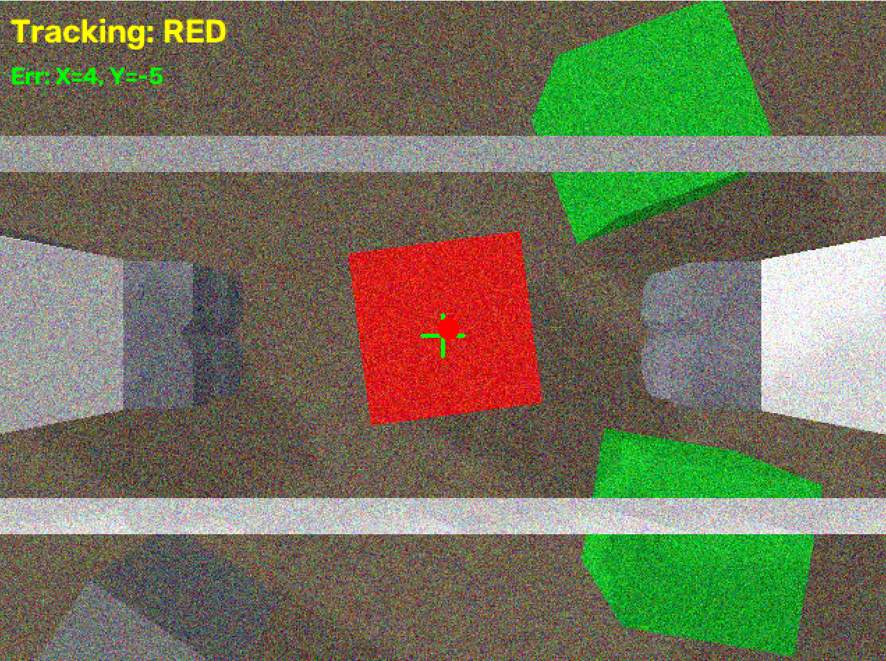

# Embodied AI Sorting System (具身智能桌面分拣系统)


本项目是一个基于 PyBullet 和 OpenCV 构建的高逼真度**具身智能桌面分拣系统 (Embodied AI Desktop Sorting)**。系统以 Franka Panda 7-DoF 机械臂为载体，不仅实现了传统的全局视觉开环分拣，还深度集成了 **Eye-in-Hand 纯视觉伺服 (IBVS)**、**自然语言驱动 (NLP Parsing)**、**Sim-to-Real 传感器抗噪** 以及 **动态阶跃扰动追踪** 等前沿机器人学算法。

<p align="center">
  
  <br>
  <i>(机械臂在带有雪花噪声和 HUD 十字准星视窗下，追踪抓取方块)</i>
</p>

## ✨ 核心特性 (Core Features)

### 👁️‍🗨️ 1. 眼在手纯视觉伺服与动态抗扰 (IBVS & Dynamic Tracking)
放弃脆弱的坐标死算，将辅摄像头挂载于机械爪末端。
* **十字准星锁定**：基于图像特征误差 ($e_x, e_y$) 实现多轴 PID 闭环追踪。
* **抗动态劫持**：在下降抓取过程中，即使方块遭受外力猛烈碰撞（支持通过 `K` 键注入物理扰动），系统也能在半空瞬间急转弯，实现“老鹰捉兔子”般的死死咬住。

### 🧠 2. 多模态调度架构 (Multi-Modal Planning)
支持在 4 种截然不同的算法模式中无缝切换：
* `manual`：**自然语言指令模式**，内置正则意图解析器，听懂如 *“先把红色的分拣了，再抓蓝方块”* 的复杂长句调度。
* `nearest`：**贪心效率模式**，全局开环下计算欧氏距离最优解，展现极致的工业分拣效率。
* `random`：**随机测试模式**，用于 Baseline 基准测试。
* `servo`：**动态伺服模式**，应对高干扰、高动态的非结构化环境。

### 🛡️ 3. Sim-to-Real 物理与视觉鲁棒性
* **高斯噪声免疫**：支持注入方差达 30 的重度传感器高斯白噪声 (`--noise` 参数)。通过形态学腐蚀分割连体色块、中值/高斯滤波阵列，在满屏雪花点中依然保持 $100\%$ 识别率。
* **3D 视差与姿态纠偏**：引入相似三角形光路模型消除侧壁造成的 1cm 视觉畸变；利用 OBB (最小外接矩形) 提取物体绝对偏转角 $\theta$，并在半空平滑扭腕实现 6-DoF 姿态对齐。
* **笛卡尔直线约束 & 柔性抓取**：底层封装 `horizontal_move` 与 `vertical_move` 彻底消灭关节空间插值导致的离心力甩脱；采用 $3.2\ \text{cm}$ 目标宽度的“微挤压”阻抗控制，实现零滑脱完美着陆。

### 📦 4. 矩阵式平铺码垛算法 (Grid Palletizing)
为解决分拣后期的“违章建筑倒塌”物理干涉问题，系统引入状态记忆阵列，采用紧凑型 $2\times 3$ 双排矩阵算法计算 `dx, dy` 偏移量，确保方块严丝合缝地安全码放在 $18\times 18\ \text{cm}$ 的托盘内。

---

## 🛠️ 安装与运行 (Installation & Usage)

### 依赖环境
```bash
pip install pybullet opencv-python numpy
```

### 一键启动
本项目提供了极其便捷的 CLI 命令行控制接口。
```bash
# 启动赛博朋克完全体：动态伺服模式 + OpenCV HUD 监控视窗 + 高斯视觉噪声
python src/main.py --mode servo --show-vis --noise

# 启动自然语言调度模式，直接下达指令
python src/main.py --mode manual --cmd "把红色和绿色的方块收了"

# 启动最高效率的开环贪心模式
python src/main.py --mode nearest

# 不加参数启动，将进入交互式终端选择菜单
python src/main.py
```

### 🎮 互动彩蛋：恶作剧踢飞测试 (Dynamic Disturbance)
当使用 `servo` 模式并开启 `--show-vis` 时：
1. 观察机器人在半空中悬停并缓慢下降瞄准。
2. 确保 PyBullet 3D 渲染窗口处于选中/激活状态。
3. **猛按键盘上的 `K` 键 (Kick)**。
4. 欣赏机械臂在半空中发现猎物逃跑后，丝滑转弯追捕的终极视觉盛宴！

---

## 📊 自动化基准测试 (Automated Benchmark)

本项目自带 Benchmark 测试脚本，用于批量评估不同算法模式在随机工况（随机角度、干扰废料、随机位置）下的成功率与耗时差异。

```bash
# 执行 10 轮 Nearest 模式测试
python src/benchmark.py --mode nearest --episodes 10

# 执行 10 轮 带高斯噪声的 Servo 模式测试
python src/benchmark.py --mode servo --episodes 10 --noise
```
*测试完成后，数据将自动导出为 `CSV` 格式并保存在 `data/` 目录下，可直接用于论文或报告的图表生成。*

---

## 📂 项目结构 (Project Structure)
```text
embodied-sorting/
├── src/
│   ├── env.py          # PyBullet 仿真环境驱动、物理引擎配置、双相机设定
│   ├── vision.py       # OpenCV 视觉感知管线 (去噪、分割、OBB姿态提取、IBVS准星锁定)
│   ├── controller.py   # 底层控制学 (逆运动学、笛卡尔直线约束、平滑扭腕、微挤压抓取)
│   ├── planner.py      # 核心状态机大脑 (多模态调度、伺服逻辑、2x3码垛算法)
│   ├── parser.py       # NLP 轻量级正则意图解析器
│   ├── main.py         # CLI 命令行入口与主循环
│   └── benchmark.py    # 自动化批处理评估与数据导出系统
├── data/               # Benchmark 生成的 CSV 实验数据存放处
├── docs/               # 演示视频、原理图与实验报告素材
└── README.md
```

## 📜 许可证 (License)
This project is licensed under the MIT License. See the `LICENSE` file for details.

---
*“在非结构化环境中，控制的优雅源于对每一毫米误差和每一牛顿物理法则的敬畏。” —— Developer*