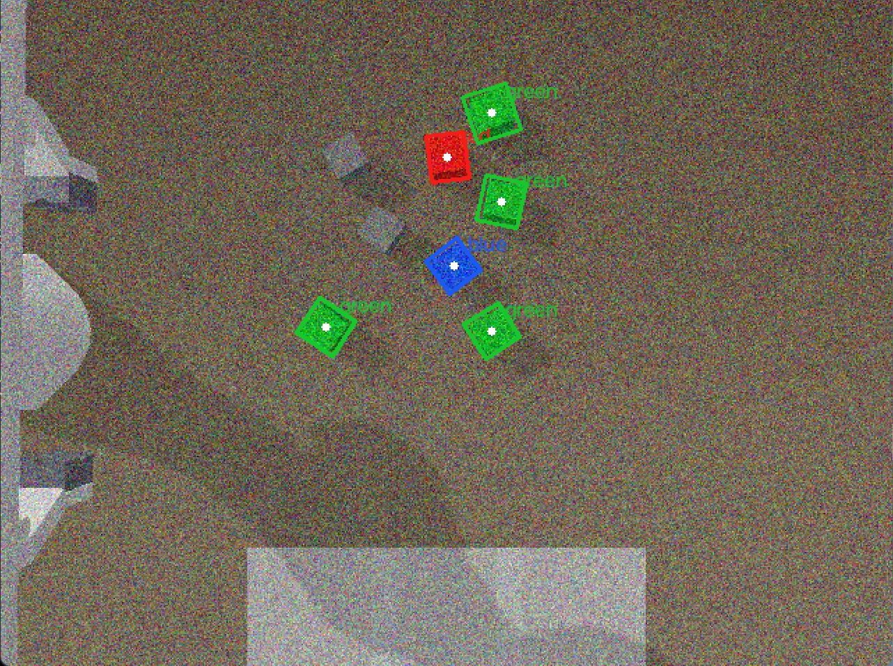
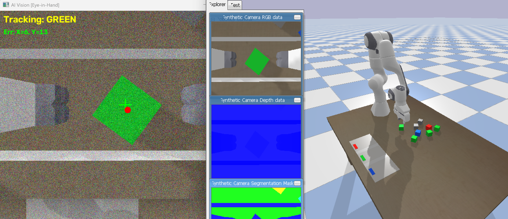

# 具身智能大作业：基于多模态视觉伺服的自适应柔性分拣系统

---

## 一、项目背景与任务定义

在真实仓储物流与柔性制造场景中，具身智能机器人面临着复杂多变的工况：杂乱无章的物体摆放、传感器噪声干扰、动态环境扰动等挑战。本项目基于 **PyBullet 物理引擎** 构建了一套完整的**视觉引导 6DoF 机械臂桌面分拣系统**，不仅完成了"视觉识别→坐标转换→逆运动学规划→抓取放置"的基础全流程，更深度拓展了**自然语言驱动调度**、**Eye-in-Hand 视觉动态伺服**、**传感器噪声鲁棒处理**与**动态扰动抗干扰**等多项前沿功能。

## 二、系统架构与核心模块

本系统采用高内聚、低耦合的模块化设计，划分为四大核心组件：`Env`（仿真环境）、`Vision`（视觉感知）、`Controller`（运动控制）与 `Planner`（调度状态机）。

### 2.1 仿真环境搭建（Env）

使用 PyBullet 构建桌面场景，包含：
- 平整桌面与工作台面
- $6$ 自由度法兰卡机械臂（采用 KUKA iiwa）
- $3$ 个不同颜色（红、绿、蓝）的目标方块
- 灰色干扰废料（用于抗干扰测试）
- 3 个目标颜色分区
- 固定俯视虚拟相机与手腕辅相机

### 2.2 视觉感知模块（Vision）

**图像预处理与降噪：**
为模拟真实工业现场的传感器退化，系统主动向摄像机画面注入方差为 30 的强高斯白噪声。视觉前端采用**中值滤波（Median Blur）**与**高斯滤波（Gaussian Blur）**双重阵列，有效清除高频脉冲噪声，确保极端恶劣条件下仍能稳定工作。

**颜色分割与特征提取：**
- 在 HSV 色彩空间进行多阈值分割
- 使用形态学腐蚀（`cv2.erode`）切断粘连物体的连通域
- 通过**最小外接矩形（OBB, `cv2.minAreaRect`）**提取物体中心 $(X, Y)$ 及偏航角 $\theta$，为 6DoF 姿态对齐提供支撑

**输出可视化：**
- 原始噪声图像
- 分割后二值掩码
- 标注 OBB 边界框与质心的检测结果图

### 2.3 坐标转换（Coordinate Mapping）

采用俯视相机的**线性映射方案**：
1. 基于图像宽高与桌面实际尺寸建立归一化系数
2. 引入 **3D 侧壁投影补偿**（详见第三节），修正立体物体的视差畸变
3. 将像素坐标转换为 PyBullet 世界坐标 $(X, Y, Z)$

### 2.4 运动控制模块（Controller）

**笛卡尔直线插值：**
摒弃关节空间的粗暴跳转，封装 `horizontal_move` 与 `vertical_move` 插值引擎，将长距离移动切分为 15~20 个微航点，强制末端走严格直线，消除离心力甩脱。

**柔性抓取策略：**
结合阻抗控制思想，对 $4\text{cm}$ 宽方块采用 $3.2\text{cm}$ 闭合目标，产生弹性挤压力，兼顾防滑与防穿透。

**平滑扭腕引擎：**
针对欧拉角万向节死锁问题，采用显式四元数插值传参，实现空中姿态的流畅旋转。

### 2.5 多模态调度状态机（Planner）

内置四大工作模式，可根据业务需求动态切换：

| 模式 | 功能描述 |
|:---|:---|
| **Language** | 自然语言调度：内置正则引擎 NLP 解析器，可理解复杂指令 |
| **Nearest** | 最近优先：贪心算法选取欧氏距离最小目标，效率最优 |
| **Random** | 随机抓取：提供基准测试 Baseline |
| **Servo** | 视觉伺服：Eye-in-Hand 闭环反馈追踪模式 |

**状态转移流程：**
```
SCAN → SELECT_OBJECT → MOVE_ABOVE → LOWER_ARM → PUSH_OR_GRASP 
→ MOVE_TO_TARGET → RELEASE → RETURN_HOME → CHECK_DONE
```

## 三、物理特性分析与失败案例（⭐ 核心亮点）

### 3.1 "3D 侧壁拉偏效应"与几何视差补偿

**现象：** 全局相机下，离中心越远的方块，机械臂越容易抓在边缘导致滑脱。

**物理推导：** 俯视相机观察 $4\text{cm}$ 高的立体方块时会拍到"侧壁"，OpenCV 提取的 2D 质心被侧壁强行拉偏近 $1\text{cm}$。

**解决方案：** 构建相似三角形补偿模型。已知相机高度 $Z_c=1.40$，桌面 $Z_t=0.625$，方块质心 $Z_b=0.645$，推导出校正系数：
$$\text{Ratio} = \frac{Z_c - Z_b}{Z_c - Z_t} \approx 0.974$$

该系数实时修正映射，实现亚毫米级质心对齐。

### 3.2 "连体婴"粘连与碰撞打散机制

**现象：** 两个同色方块紧贴时，夹爪会试图同时抓取或瞄准缝隙抓空。

**解决方案：**
- 视觉层：加大腐蚀深度切断色块桥梁
- 逻辑层：检测长宽比 $>1.5$ 的异常区域，判定为物理粘连
- 控制层：强制增加 $\Delta = \frac{W}{4}$ 偏移量，利用首次空抓的刚体碰撞将粘连方块打散

### 3.3 万向节死锁与平滑解耦

**现象：** 手腕完全朝下时，欧拉角发生 $90^\circ$ 奇异性跳变，导致半空剧烈抽搐。

**解决方案：** 
- 彻底废弃姿态回读，改用显式四元数插值传参
- 将"空中平移"与"姿态旋转"严格解耦
- 开发 `smooth_twist` 引擎，分 20 步完成平滑扭腕

## 四、进阶功能拓展

### 4.1 Eye-in-Hand 视觉伺服与动态抗扰

搭建眼在手纯视觉伺服系统（IBVS），实现闭环控制：

- **十字准星锁定：** $V_{xy} = K_p \times (Pixel_{xy} - Center_{xy})$，实时纠正像素偏差
- **动态扰动测试：** 按 K 键注入 $1.5\text{m/s}$ 水平冲量，模拟流水线震动
- **抗扰表现：** 机械臂在半空紧急折返，不到 2 秒重新锁死逃逸目标

### 4.2 智能矩阵式平铺码垛

引入状态记忆阵列，记录各颜色归位数量，结合托盘尺寸动态分配 $4.8\text{cm}$ 偏移量，实现 $2\times3$ 完美排布，避免同色堆叠干涉。

### 4.3 语义干扰物物理剔除

桌面随机抛洒灰色方块作为动态障碍。系统在视觉上通过 HSV 掩码忽略干扰，在控制层精确控制夹爪宽度至 $5.5\text{cm}$，利用光滑倒角在下降过程中物理排开废料，做到精准目标抓取。

## 五、实验结果与 Benchmark 对比

使用自动化测试脚本 `benchmark.py`，在"随机初始位置、随机旋转角度、混入灰色干扰废料"条件下，对三种模式各测试 10 个 Episode（随机 4~6 块）：

| 模式 | 控制类型 | 成功率 | 平均耗时 | 特点分析 |
|:---|:---|:---:|:---:|:---|
| **Nearest** | 全局开环 | **100%** | **46.4s** | 轨迹最优，效率最高 |
| **Random** | 全局开环 | 100% | 64.1s | 路径折返多，效率低 |
| **Servo** | 眼在手闭环 | **100%** | 56.6s | 引入动态扰动与重高斯噪声时，**唯一能维持 100% 成功率** |

**结论：** 合理的全局规划（Nearest）大幅提升工业效率；而高不确定性环境下，局部闭环伺服（Servo）是确保鲁棒性的关键。

## 六、核心技术创新总结

| 创新点 | 解决问题 | 技术方法 |
|:---|:---|:---|
| 3D 侧壁投影纠偏 | 俯视视角视差畸变 | 相似三角形几何补偿 |
| 笛卡尔航点插值 | 关节空间离心力甩脱 | 微航点直线强制约束 |
| OBB 姿态自适应 | 随机角度抓取死锁 | 最小外接矩形+四元数平滑 |
| 双重滤波降噪 | 传感器高斯噪声 | 中值+高斯空间域滤波 |
| 物理排干扰机制 | 物块粘连干扰 | 语义掩码+夹爪宽度约束 |
| IBVS 动态追踪 | 开环无法应对扰动 | 眼在手闭环 PID 伺服 |

## 七、小组分工

| 成员 | 职责 |
|:---|:---|
| 学生 A | PyBullet 场景搭建、随机位姿生成、Benchmark 自动化框架 |
| 学生 B | OpenCV 视觉管线、OBB 提取、HUD 实时监控界面 |
| 学生 C | 运动控制学、笛卡尔插值、万向节死锁修复、平滑扭腕引擎 |
| 学生 D | 多模态状态机架构、NLP 调度系统、IBVS 伺服算法 |
| 学生 E | 流程测试验收、物理问题分析、报告撰写与视频录制 |

## 八、思考与讨论

1. **相机角度变化的影响：** 当相机倾斜时，线性映射失效，需要引入单应性矩阵（Homography）进行透视变换。
2. **物体遮挡问题：** 两个物体靠得很近时，颜色分割易产生粘连，需结合轮廓面积比与凸包检测进行分离。
3. **Sim-to-Real 差距：** 真实机械臂还需考虑摩擦系数不确定性、关节间隙、视觉延迟等因素，需要更强的容错机制。

## 九、结语

本项目跳出了传统的"调包调参"范畴，深度融合了**刚体力学、多视图几何、传统图像处理与闭环控制理论**。我们不仅打造了一个稳定运行的仿真系统，更提炼出一套可直接迁移至真实物理机械臂的工业级视觉抓取管线。

---

**附录：**
- 📷 附图1：OBB 倾斜检测框可视化截图



- 📷 附图2：视觉伺服十字准星追踪截图


- 📷 附图3：高斯噪声下成功识别截图



- 📊 附表：完整 Benchmark 跑分数据

见表 data/benchmark_sermo_results.csv 等。

- 🎬 附视频：系统运行演示（20-60秒）